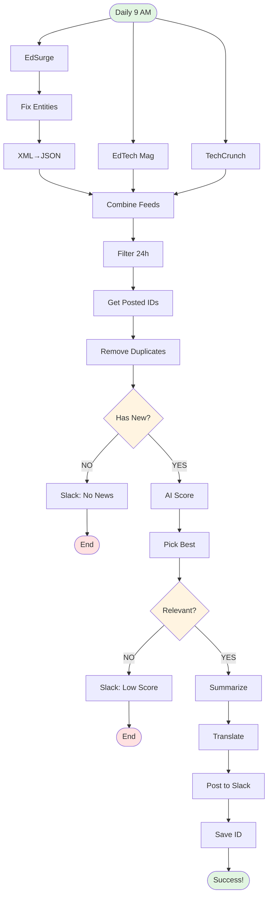

```mermaid
graph TD
    Start([Daily 9 AM]) --> RSS1[EdSurge]
    Start --> RSS2[EdTech Mag]
    Start --> RSS3[TechCrunch]
    
    RSS1 --> Fix[Fix Entities]
    Fix --> XML[XML→JSON]
    XML --> Merge
    RSS2 --> Merge[Combine Feeds]
    RSS3 --> Merge
    
    Merge --> Filter[Filter 24h]
    Filter --> GetIDs[Get Posted IDs]
    GetIDs --> Dedupe[Remove Duplicates]
    
    Dedupe --> Check1{Has New?}
    Check1 -->|NO| NoNews[Slack: No News]
    Check1 -->|YES| Score[AI Score]
    
    NoNews --> End1([End])
    
    Score --> Pick[Pick Best]
    Pick --> Check2{Relevant?}
    
    Check2 -->|NO| LowScore[Slack: Low Score]
    Check2 -->|YES| Sum[Summarize]
    
    LowScore --> End2([End])
    
    Sum --> Trans[Translate]
    Trans --> Post[Post to Slack]
    Post --> Save[Save ID]
    Save --> End3([Success!])
    
    style Start fill:#e1f5e1
    style End1 fill:#ffe1e1
    style End2 fill:#ffe1e1
    style End3 fill:#e1f5e1
    style Check1 fill:#fff4e1
    style Check2 fill:#fff4e1
```